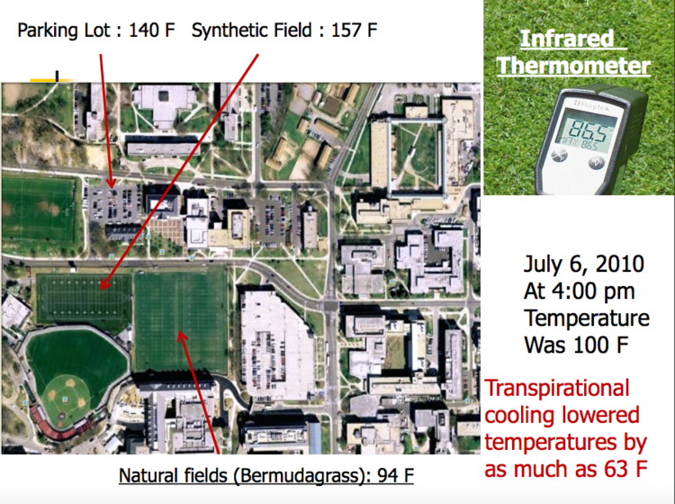

# Hack4Sodertalje

## Problem statement 
From elsewhere we know that extreme weather adversely affects vulnerable and excluded groups, while people with more available resources and better networks will do just fine. 

**Our focus here is the impact of heat waves on the vulnerable population**, though it can be applied to other extremes, such as extreme cold, extreme precipitation, extreme wind, smoke from forest fires and the like. 

The same groups are exposed: The sick, the elderly, the homeless, the poor. High energy prices this winter showed how, under wrong circumstances, the group of vulnerable people could grow larger than that. Södertälje is not a city characterised by extreme weather, nor will it be, but it is better prepared for some than for others. So let us turn up the heat.

This tool is designed for dual use, scenario planning and adverse weather information. Planners can correct weak spots ahead of time, while when the heat is here the affected (or their carers) can see how best to adapt. This goes for less extreme weather as well. Where others may feel a slight discomfort or even find it enjoyable, it will be a barrier for our groups from taking part in public life. This barrier can be reduced with some planning. 

It is an iterative tool, as it is used it will show which data sets are missing and motivate their owners to open these up. It is also intended to be used in other planning tools, for instance as an overlay. 

## What we look for (change this subtitle)

Adverse effects of heat waves on mortality among vulnerable group of population are well known. Heat waves in Sweden used to occur once in every 20 years in the past century. But this new millenium has given us a new climate challenge where it has occured 4 times since 2000. As suggested by the Swedish researchers from Umea extended hot days of 27 degree - 30 degrees for 3 consecutive days will increase the mortality and cardiovascular helth risk between 10 and 20 %[1]. Research suggests that effects of climate change will increase the occurance of heat waves and consecutive hot days during summer. This in turn will affect the elderly and people with cardiovascular diseases. 

PREPAREDNESS
* Based on this we should have analyse the improvements necessary to existing infrastructures in Sodertalje municipality to provide "cool-down" spots to it's residents. 
* Suggestions to increase resting spots under shades. 
* Public air conditioned spaces.
* Indoor activies on hot days to move from homes to air conditioned spaces. 
* Increasing public toilets and it's quality for people with difficutlies to feel welcomed on the city center (Instead of the current tin can in the middle of the city) 
* Temperature and details of bath places.

ALERT SYSTEM
* Early warning systems from solid scientific basis to forecast severness of hot weather during summer. 
* Social media campigns to spread awareness of things to do on hot days.
* Mark places having heat island effects. 
* An info system on places to go on hots with temprature on bath places. (We have that data on open data) And systems to detect nearby "cool-down" spots.

## Our tool - Sodertalje's Heat Wave Alert System

To understand our hack, one should first have a clear idea on how temperatures are calculated in a city. National climate centers generally install a sophisticated thermometer unit at a select location, usually near airport in bigger cities, to gather daily mean temperature readings. These readings don't consider the influence of surrounding structures on the temperature at that location and it will be that much difficult to predict the actual temperature impact at a discrete street level. 

For example, in the picture below, one can see 3 different temperature readings in different locations in a city. This indicates that the problems needs to be tackled at a much more discrete/granular level, for which, we don't have the technological architecture at this moment. 

During the first stage of the hack, we propose to collect granular (street-level) temperature data using any of the following methods to identify hot-spots at a granular street level. 
1. Use satellite data to get granular (street-level) temperature data. 
2. Install temperature sensors at different streets (this solution might not be cost-effecient)
3. Distributed temperature collection using mobile phones (Some of current Mobile phones are equipped with temperature sensors)

Second half of our hack deals with identifying locations across Sodertalje municipality that could potentially serve as **cool-down** spots. Identifying these "cool-down" spots across a city without hugely modifying the current state infrastructure is the core idea of our solution. We identify and define **cool-down** spots in as:
1. Concrete-shaded regions 
2. Green-shaded regions 
3. Public air-conditioned or bath spaces

Finally, we bring everything together via:  
* An **alert** system to forecast severness of hot weather at a street-level granularity based on temperature data collected. 
* A location-based **messaging** system to suggest nearby "cool-down" spots.

## Data Sources
A multitude of data sources have been gathered for our hack. 
1. [Survey Results from Senior Population](./data/survey-results)
2. [Historical Temperature changes](./data/stockholm-historical-temps-monthly-3)
3. [Demographics of the City](./data/demographics-data)
4. [Bath places in the City](./data/bath-places)
5. [Green spaces in the City](./data/green-spaces-geojson-data)
6.  

## Workflow - The Data Pipeline

## What data says?

## Outcome of the Hack

## Reference
[1] https://doi.org/10.1016/j.maturitas.2011.03.008
[2] https://www.vox.com/22557563/how-to-redesign-cities-for-heat-waves-climate-change
